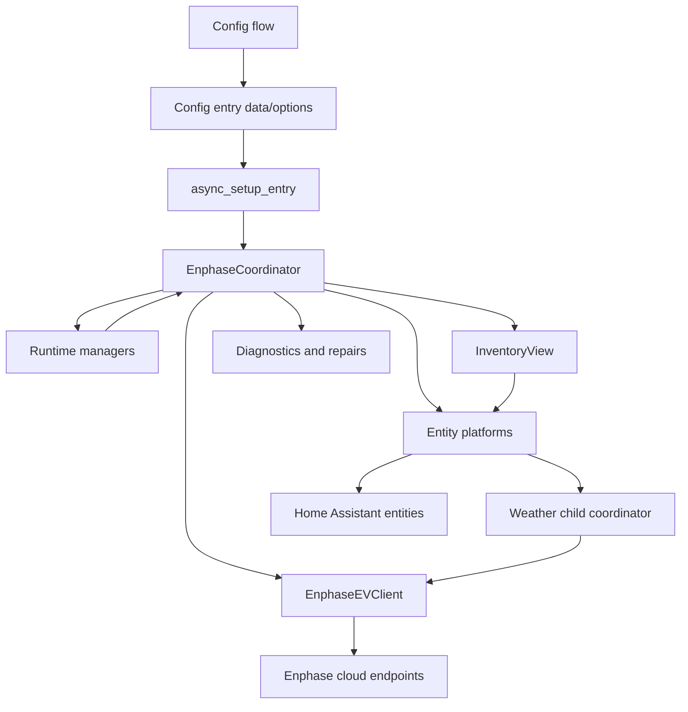
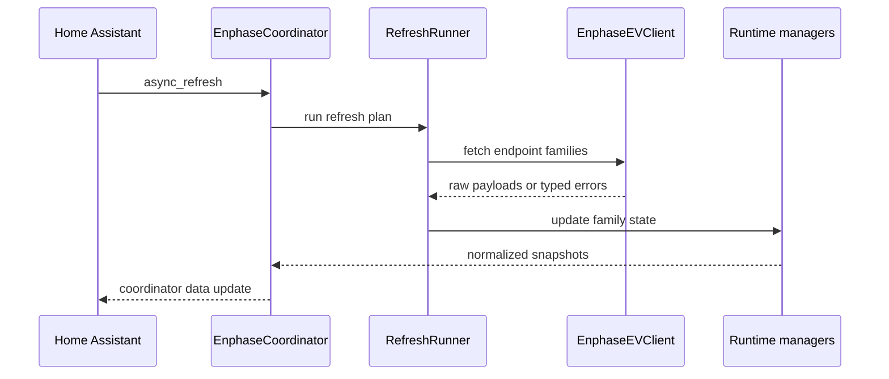

# Architecture

This document is a contributor map for the Enphase Energy integration. It explains where behavior lives and how the main pieces interact. For domain terms, see the [glossary](glossary.md).

## Runtime Shape

Each Home Assistant config entry owns one `EnphaseCoordinator`. The coordinator is the integration boundary for entities: platforms read normalized state from the coordinator and call coordinator/service helpers for writes. Entities should not call the cloud client directly unless a local helper already establishes that pattern.

## Setup And Authentication

`config_flow.py` handles user login, MFA, site selection, device-category selection, reconfigure, and reauth entry updates. `options_flow.py` owns options forms; `config_flow_support.py` and `config_selection.py` share discovery and selection policy. It stores the tokens and cookies needed for refreshes in the config entry. The password is stored only when the user opts into remembered credentials so the integration can attempt automatic token refresh.

`__init__.py` handles config entry setup and unload. It creates the coordinator
and invokes its public bootstrap API. Coordinator-owned `_async_setup` restores
compact discovery state and starts an independent power-acquisition task before
the authoritative status refresh. Config-entry setup blocks only on that refresh
before forwarding platforms.
Translation and integration-version priming run concurrently with that work.
Optional endpoint families then warm up in feature-aware stages, publishing after
each stage so one slow family does not hold back unrelated state. Schedule sync and
other long-running work start in the background.

Config-entry update handling distinguishes live-applicable options from topology
changes. Polling, timeout, history, voltage, scheduler, pricing, and notification
options are applied to the existing coordinator and published without unloading
entities. Changes that alter platform topology still reload the config entry, but
`reload_snapshot.py` transfers detached discovery metadata and charger data so
platforms can recreate entities promptly. Setup constructs a new coordinator and
private session; the previous lifecycle fully cancels its tasks and shuts down.
No session, manager, lock, or task crosses the reload. New option and device
selections are applied before restored data is published, followed by a background
refresh. Cold setup continues to require an authoritative first refresh.
The default-off VPP Events device feature is one of those topology options. Its
reload clears the VPP cache before optional warmup so disabling the feature cannot
publish preserved event state or make requests to the VPP service.
Installer Grid Profile controls are also a default-off topology option. Disabled
entries skip both the startup Activation probe and steady metadata refreshes;
config-entry migration enables the option only when an existing Current Grid
Profile entity demonstrates prior use.

`registry_migrations.py` owns versioned migrations and `registry_sync.py` owns
ongoing reconciliation. Device and entity registry cleanup is intentionally conservative. Startup migrations
run once per migration version, while normal reconciliation runs only when the
coordinator reports a topology change—not for ordinary telemetry updates. Cleanup
still waits for inventory readiness so transient cloud discovery failures do not
remove user-customized entities.

## Coordinator And Refresh Flow

`coordinator.py` owns polling cadence, auth refresh coordination, endpoint health, backoff state, runtime managers, and normalized integration state. `refresh_plan.py` defines which endpoint families are refreshed in each phase. `refresh_runner.py` executes those plans and isolates optional endpoint failures so one unhealthy Enphase service does not fail the whole coordinator refresh.

The coordinator distinguishes core failures from optional endpoint failures:

- Auth failures can trigger Home Assistant reauth or an auth-block repair issue.
- Rate limits and cloud outages enter bounded backoff and expose diagnostic sensors.
- Optional endpoint failures mark that family stale, preserve recent useful data where safe, and report repairs when needed.

Authentication refresh uses its own lock and one shared, cancellation-shielded
login task, so a 401 during a poll cannot reacquire the poll lock. Each retry
builds authentication headers from current credentials. Startup enrichment
merges its changes into current charger data after awaits, preserving intervening
commands, polls, and removals.

Cloud request metrics are scoped to logical operations. Core refresh, startup
warmup, session-history enrichment, and schedule sync use separate scopes, so
the coordinator's rolling performance history reports only work performed for
that refresh. Failed and cancelled refresh attempts are retained in the same
bounded history. Request-layer queue, network, and parsing totals are included
when the HTTP boundary supplies them.

Startup diagnostics separately expose config-entry phase durations and elapsed
milestones for core readiness, entity forwarding, power readiness, setup completion,
and warmup completion. Keep optional network work out of the config-entry critical
path unless Home Assistant cannot safely create the integration without it.

## Cloud Client

`api.py` is the stable public compatibility facade for the HTTP boundary. It
retains `EnphaseEVClient` and the existing authentication/error imports used by
the integration. Cohesive implementations live under `api_client/`:

- `transport.py` owns injected-`ClientSession` authentication requests and response handling.
- `auth.py` owns login, MFA, cookie, and XSRF request shaping.
- `site_surface.py` owns site telemetry and VPP behavior.
- `header_surface.py` and `request_surface.py` own per-attempt headers, authenticated retries, timeouts, and response decoding.
- `battery_surface.py` owns BatteryConfig settings and schedules.
- `evse_surface.py` owns charger controls, livestream, and EVSE scheduler requests.
- `dashboard_surface.py` owns dashboard, tariff, inventory, and history requests.
- `activation_surface.py` owns installer grid-profile requests.
- `mqtt.py`, `errors.py`, and `common.py` hold MQTT parsing, sanitized error metadata, and shared guards.

The facade remains intentionally thin for migrated slices. New cloud behavior
should be added to a cohesive internal surface rather than growing `api.py`.
Transport modules accept the injected `ClientSession`; surface functions use the
client facade through typed boundaries and do not create or own sessions. This keeps the boundary suitable for eventual
extraction into an independent async client library without adding a runtime
dependency today.

Several Enphase surfaces behave like browser-backed applications rather than stable public APIs:

- Enlighten pages and XHR endpoints need browser-like headers and cookies.
- BatteryConfig has multiple auth/header/XSRF shapes depending on site, region, and firmware.
- Scheduler and EVSE control endpoints can accept writes before read endpoints reflect the new state.
- Some optional endpoints return HTML, login pages, or non-JSON success responses.

Keep new endpoint handling inside `api_client/` or narrow parser modules so
coordinator and entity code remain normalized. Preserve compatibility exports
from `api.py` when moving existing behavior.

### Weather child coordinator

Weather is the deliberate exception to the one-main-coordinator polling model.
It is optional, discovered independently, and uses a 15-minute cadence that
should not affect core integration availability. The weather platform therefore
owns an `EnphaseWeatherCoordinator` child. The config entry's typed runtime data
tracks both the child and its discovery task, unload explicitly cancels/releases
them, and config-entry diagnostics report discovery and update health. Entities
must not create additional independent coordinators without documenting the
lifecycle and diagnostics ownership here.

## Runtime Managers

Runtime managers keep endpoint-family behavior out of the main coordinator:

- `battery_runtime.py` handles BatteryConfig controls, profile state, schedules, pending writes, and battery diagnostics payloads.
- `evse_runtime.py` handles charger commands, fast polling, streaming, charge-mode cache, auth settings, and EVSE control side effects.
- `inventory_runtime.py` handles topology, type buckets, HEMS inventory, and system-dashboard payloads.
- `heatpump_runtime.py` handles HEMS heat-pump runtime state, daily consumption, and diagnostics snapshots.
- `current_power_runtime.py`, `evse_feature_flags_runtime.py`, `auth_refresh_runtime.py`, and `ac_battery_runtime.py` handle smaller endpoint families.
- `system_events.py` independently manages active System Dashboard events and the
  bounded, on-demand homeowner event-history cache used by the Cloud calendar.
- `vpp_runtime.py` owns the opt-in VPP/ELRP enrollment state, singular enrolled
  program lookup, normalized event cache, one-hour stale-data policy, and
  identifier-free diagnostics. Enrollment is refreshed every six hours and may
  reuse a confirmed program for seven days; event data is refreshed every five
  minutes. Its immutable snapshot participates in aggregate snapshot equality so
  VPP-only changes notify entity listeners.

These managers should own cache lifetimes, stale data decisions, and endpoint-specific parsing for their family. The coordinator should expose their normalized state through properties and helper methods.

New manager state is published through immutable snapshots rather than projected
private coordinator fields. The aggregate integration snapshot determines update
equality while preserving the historical dictionary-shaped `coordinator.data`
interface. Charger acquisition timestamps do not define equality. Auth, EVSE
controls, endpoint health, battery, heat-pump, inventory, site energy, tariffs,
and system events do participate,
so device-family-only changes still publish. `feature_snapshot.py` freezes these
legacy family states, detaches nested dataclass content, compares values, and reuses unchanged immutable
mappings. Cache deadlines and diagnostic-only payloads are excluded; schedule
inventory remains included because editor entities read it.

Auth and EVSE state live with their runtimes. Battery, heat-pump, and inventory
runtimes receive their state explicitly; compatibility coordinator projections
remain for existing consumers. Migrate those consumers incrementally instead of
introducing additional dynamic fields. See [ADR 0001](adr/0001-runtime-state-ownership.md) for dependency,
ownership, and incremental migration rules.

## Inventory And Entity Gating

`inventory_runtime.py` builds type buckets from cloud inventory. `inventory_view.py` is the read-facing layer used by entity platforms to decide whether a type should exist or be available. `device_types.py` normalizes Enphase product labels into canonical type keys.

Entity platforms under `sensor.py`, `binary_sensor.py`, `button.py`, `number.py`, `select.py`, `switch.py`, `time.py`, `calendar.py`, and `update.py` create Home Assistant entities from coordinator state. `sensor.py` remains the sensor platform and discovery entry point; cohesive battery and heat-pump entity models live in `sensor_battery.py` and `sensor_heatpump.py`, with gateway, inverter, site-energy, and tariff models in `sensor_gateway.py`, `sensor_inverter.py`, `sensor_site_energy.py`, and `sensor_tariff.py`. Shared presentation and normalization boundaries live in `sensor_base.py`, `sensor_common.py`, and `sensor_snapshot_helpers.py`. New device families should follow that split instead of adding payload interpretation to the platform entry point. Platform setup usually follows this pattern:

1. Add site-level entities that are supported by selected inventory types and permissions.
2. Add charger or device entities for discovered serials/type members.
3. Wait for inventory readiness before pruning managed entity registry entries.
4. Use optimistic coordinator caches only when Enphase writes are known to settle asynchronously.

Instantaneous site telemetry has bounded freshness: after a core outage, the
last successful sample has a 15-minute grace period. Battery and heat-pump
measurements with an established family success expire after 30 minutes without
that family succeeding, even when core polling still works. Entity-owned timers
publish expiry without waiting for another coordinator callback and are cancelled
on recovery/removal. Current-power and VPP managers retain their separate
source-specific policies. Cumulative energy totals remain available as historical
measurements. Daily heat-pump totals expose a source-day `last_reset` so recorder
handles midnight and within-day corrections correctly.

Inverter discovery uses `inverter_inventory.py` for bounded pagination with an
explicit completeness result. Partial, repeated, or malformed inventory cannot
authorize pruning previously known devices.

VPP/ELRP is a Cloud-device feature, not a separate device family. `calendar.py`
and `sensor_vpp.py` dynamically publish six read-only entities only after a valid
events response, or immediately from their registry records during a reload. A
confirmed unenrolled response removes them; ambiguous enrollment keeps registered
entities unavailable and never selects an eligible program speculatively.

`discovery_snapshot.py` persists only stable identity and capability metadata
needed to restore entity discovery before live inventory arrives. It observes a
lightweight discovery revision on refresh completion; unchanged telemetry does
not deep-copy or JSON-serialize inverter and battery snapshots. Delayed writes
coalesce revisions and reuse the already captured compact payload.

## Diagnostics, Redaction, And Repairs

`diagnostics.py` builds Home Assistant config-entry and device diagnostics. `coordinator_diagnostics.py` builds coordinator health snapshots and manages repair issues. `log_redaction.py` and `runtime_helpers.redact_battery_payload` are the shared redaction helpers.

Optional Enphase service degradation still updates diagnostics and service-status entities when degraded service repair issues are disabled in the integration options; only the Home Assistant Repairs notifications are suppressed and cleared.

Diagnostics may include raw or near-raw Enphase payloads after redaction. Any new diagnostics payload should be reviewed for:

- Tokens, cookies, credentials, emails, user IDs, and auth headers.
- Site IDs, serials, device UIDs, MAC addresses, IP addresses, hostnames, URLs, and modem/SIM identifiers.
- Nested payloads where future fields may add identifiers.

VPP diagnostics deliberately expose only enrollment/availability state, aggregate
event counts, last-success and cached-data flags, and truncation. Site, enrollment,
program, event, gateway, and request identifiers are never included.

When in doubt, redact broadly and expose counts, status summaries, field names, or shape summaries instead of raw values.

Domain actions are registered once during integration setup and remain registered
after unloading the last entry. `service_routing.py` requires loaded runtime data
for actions and resolves targets without falling back from an invalid explicit
entry to another site. Platform setup uses a separate runtime accessor.

## Schedule Editing And Sync

EVSE schedules use Home Assistant schedule helpers through `schedule_sync.py`. The sync layer mirrors Enphase scheduler slots into helper entities and pushes helper changes back to Enphase. It keeps server timestamps as optimistic concurrency metadata and refreshes shortly after writes because scheduler reads can lag writes.

Battery schedule editing is separate and lives in `battery_schedule_editor.py`. It normalizes BatteryConfig schedule families (`cfg`, `dtg`, `rbd`) into one editor model while preserving schedule type, days, limits, and fallback state from coordinator scalar fields.

`schedule.py` normalizes EVSE slot payloads before scheduler writes. Preserve unknown or scheduler-owned fields unless there is a specific reason to drop them; Enphase PATCH endpoints often expect more than the fields directly edited by the UI.

## Adding New Behavior

Use this starting-point map:

- New cloud endpoint: implement it in the relevant `api_client/` surface and add a thin `api.py` facade method when needed; keep payload normalization in a parser/helper.
- New endpoint family state: add or extend a runtime manager, then expose normalized coordinator properties.
- New entity: add the entity in the relevant platform and gate it through `InventoryView` or existing coordinator capability flags.
- New diagnostic payload: add redaction first, then add summaries or payload copies.
- New user-facing string: update `strings.json`, every locale file under `translations/`, and translation tests when applicable.
- New control action: route through coordinator/runtime helpers, translate validation failures, and update optimistic caches only when the Enphase read-after-write behavior requires it.

## Testing Pointers

Keep tests close to the changed behavior under `tests/components/enphase_ev/`.

- Coordinator refresh and endpoint health: `test_coordinator_*.py`, `test_rate_limit_and_switch_kick.py`, `test_latency_and_connectivity.py`.
- API client and parsers: `test_api_*.py`, `test_session_history_parsers.py`, `test_evse_timeseries.py`, `test_site_energy.py`.
- Entity setup and cleanup: `test_entity_*.py`, `test_device_info.py`, `test_inventory_runtime.py`.
- Battery controls and schedules: `test_battery_*.py`, `test_battery_schedule_editor_parity.py`.
- EVSE controls and schedules: `test_evse_*.py`, `test_select_charge_mode.py`, `test_schedule_sync.py`.
- Diagnostics and redaction: `test_diagnostics*.py`, `test_log_redaction.py`, `test_payload_debug.py`.
- Framework lifecycle and queued entry changes: `test_entry_lifecycle.py`, `test_reload_snapshot.py`, `test_init_module.py`.
- Concurrent authentication and publication: `test_transport_publication_contracts.py`, `test_feature_snapshot.py`, `test_evse_state.py`.
- Recorder statistics, serialization, and actual stale entity states: `test_entity_architecture.py`.

Use the pinned Docker commands from `CONTRIBUTING.md` for validation.
