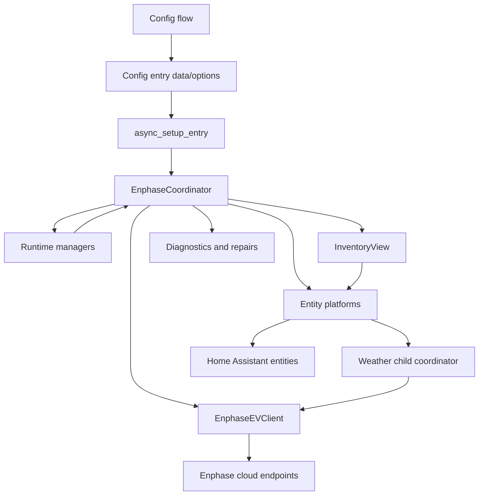
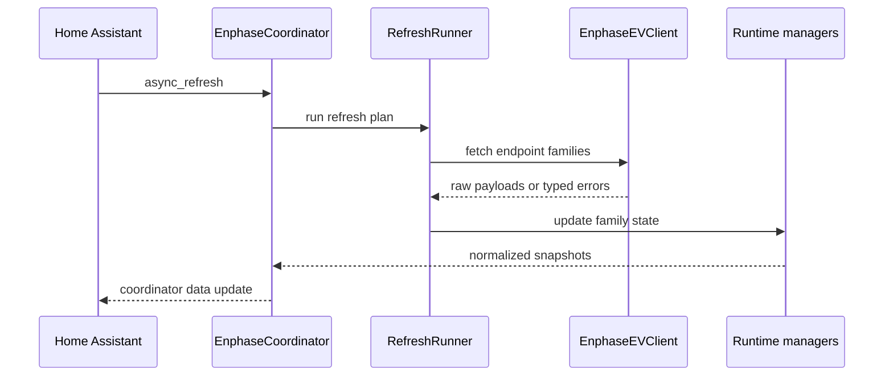

# Architecture

This document is a contributor map for the Enphase Energy integration. It explains where behavior lives and how the main pieces interact. For domain terms, see the [glossary](glossary.md).

## Runtime Shape

Each Home Assistant config entry owns one `EnphaseCoordinator`. The coordinator is the integration boundary for entities: platforms read normalized state from the coordinator and call coordinator/service helpers for writes. Entities should not call the cloud client directly unless a local helper already establishes that pattern.

```mermaid
flowchart TD
    A["Config flow"] --> B["Config entry data/options"]
    B --> C["async_setup_entry"]
    C --> D["EnphaseCoordinator"]
    D --> E["EnphaseEVClient"]
    D --> F["Runtime managers"]
    D --> G["InventoryView"]
    D --> H["Entity platforms"]
    H --> W["Weather child coordinator"]
    W --> E
    E --> I["Enphase cloud endpoints"]
    F --> D
    G --> H
    H --> J["Home Assistant entities"]
    D --> K["Diagnostics and repairs"]
```

## Setup And Authentication

`config_flow.py` handles user login, MFA, site selection, device-category selection, reconfigure, and reauth entry updates. `options_flow.py` owns options forms; `config_flow_support.py` and `config_selection.py` share discovery and selection policy. It stores the tokens and cookies needed for refreshes in the config entry. The password is stored only when the user opts into remembered credentials so the integration can attempt automatic token refresh.

`__init__.py` handles config entry setup and unload. It creates the coordinator
and invokes its public bootstrap API. Coordinator-owned `_async_setup` restores
compact discovery state and starts an independent power-acquisition task before
the authoritative status refresh. Config-entry setup blocks on that refresh before
forwarding platforms, with degraded setup permitted for charger-status HTTP 5xx
failures as described under [charger-status recovery](#charger-status-recovery).
Translation and integration-version priming run concurrently with that work.
Optional endpoint families then warm up in feature-aware stages, publishing after
each stage so one slow family does not hold back unrelated state. Schedule sync and
other long-running work start in the background.

Config-entry update handling distinguishes live-applicable options from topology
changes. Polling, timeout, history, voltage, scheduler, pricing, and notification
options are applied to the existing coordinator and published without unloading
entities. Changes that alter platform topology still reload the config entry, but
`reload_snapshot.py` transfers detached discovery metadata and charger data so
platforms can recreate entities promptly. Setup constructs a new coordinator and
private session; the previous lifecycle fully cancels its tasks and shuts down.
No session, manager, lock, or task crosses the reload. New option and device
selections are applied before restored data is published, followed by a background
refresh. Cold setup requires an authoritative first refresh except for isolated
charger-status server failures.
Battery status and inverter inventory readiness also participate in topology
comparison. Restored discovery metadata preserves device identities without
restoring authoritative endpoint payloads. The first successful refresh must
notify entity discovery even when those identities have not changed, so
per-device battery and enabled inverter sensors are created after a reload.

When the configured charger selection is unchanged, reload handoff preserves the
previous discovered serial list (including an empty list) and drops telemetry for
retired chargers. Historical config-entry serials cannot recreate devices while
fresh inventory is pending; explicit selection changes still apply immediately.
The default-off VPP Events device feature is one of those topology options. Its
reload clears the VPP cache before optional warmup so disabling the feature cannot
publish preserved event state or make requests to the VPP service.
Export Limit controls are a default-off topology option. Toggling them reloads
the entry to start or stop the dedicated PEL runtime and reconcile its entities.
The runtime persists pending intent, never form tokens, and resumes readback
after reload. It polls at the configured fast interval for ten minutes after a
write, then at the standard interval; an unconfirmed-request repair is owned by
that runtime and cleared on unload or matching readback.
The guided Export Limit menu uses one Enable Export Limit action for both zero
and nonzero limits: 0 W requests no grid export, and a positive value sets the
maximum permitted export power. Both proceed through the same confirmation step.
The menu shows the pending request’s wattage or Disabled while a request remains,
and None when it has been cleared, regardless of the last request status.
All Export Limit writes automatically reconcile an installer form's zero slew-rate
default when every other form setting matches fresh gateway readback and the
requested rate preserves the gateway's positive slew rate. Before submitting,
the shared runtime resolves the current gateway identity, verifies the snapshot
is unchanged, and fetches and validates a fresh form token. This applies when
enabling, changing, or disabling a limit through the selector, guided flow, or
service. The guided flow still requires confirmation of the requested change;
no separate restore checkbox is needed. The displayed requested slew rate is
frozen for that confirmation, even if saved defaults change while the dialog is
open. A changed gateway snapshot resets that rate for the next review. Dynamic
mode, nonpositive gateway rates, nonzero form disagreements, and changed or
ambiguous gateway identity remain
blocked. Actual readback changes request reconfirmation; installer-form conflicts
report that Enphase's form disagrees with the gateway settings.
Options forms that navigate to another input or confirmation step set
`last_step=False` to show Home Assistant’s translated Next button. Forms that
save options or apply gateway changes retain Submit.
The options menu separates device category selection (Devices) from feature
configuration (Features). Features contains Device Features and Advanced Features;
the latter groups installer Grid Profile controls, Export Limit controls, and
Microinverter Power.
Installer Grid Profile controls are also a default-off topology option. Disabled
entries skip both the startup Activation probe and steady metadata refreshes;
config-entry migration enables the option only when an existing Current Grid
Profile entity demonstrates prior use.
When enabled, the Grid Profile Control menu remains visible during discovery
failures. Rejected Settings-page sessions first use shared, bounded authentication recovery.
Exhausted recovery produces `session_expired` and starts Home Assistant reauth
without failing unrelated endpoint families; permission denial does not start reauth.
Expected HTML pages require actual login controls for login-wall detection, rather
than branding or consent scripts shared by valid pages. Installer bootstrap and
array panel-rating reads use the private cookie-header session so shared-session
cookies cannot override the current saved credentials.

`registry_migrations.py` owns versioned migrations and `registry_sync.py` owns
ongoing reconciliation. Device and entity registry cleanup is intentionally conservative. Startup migrations
run once per migration version, while normal reconciliation runs only when the
coordinator reports a topology change—not for ordinary telemetry updates. Metadata
listeners compare compact charger and cached type-device signatures independently
of topology so firmware/model changes update device records. Unchanged metadata
does not run registry reconciliation or cleanup. Cleanup
still waits for inventory readiness so transient cloud discovery failures do not
remove user-customized entities.

## Coordinator And Refresh Flow

`coordinator.py` owns polling cadence, auth refresh coordination, endpoint health, backoff state, runtime managers, and normalized integration state. `refresh_plan.py` defines which endpoint families are refreshed in each phase. `refresh_runner.py` executes those plans and isolates optional endpoint failures so one unhealthy Enphase service does not fail the whole coordinator refresh.

```mermaid
sequenceDiagram
    participant HA as Home Assistant
    participant Coord as EnphaseCoordinator
    participant Runner as RefreshRunner
    participant Client as EnphaseEVClient
    participant Runtime as Runtime managers

    HA->>Coord: async_refresh
    Coord->>Runner: run refresh plan
    Runner->>Client: fetch endpoint families
    Client-->>Runner: raw payloads or typed errors
    Runner->>Runtime: update family state
    Runtime-->>Coord: normalized snapshots
    Coord-->>HA: coordinator data update
```

The coordinator distinguishes core failures from optional endpoint failures:

- Auth failures can trigger Home Assistant reauth or an auth-block repair issue.
- Rate limits and cloud outages enter bounded backoff and expose diagnostic sensors.
- Optional endpoint failures mark that family stale, preserve recent useful data where safe, and report repairs when needed.

`endpoint_policies.py` defines immutable cache and cooldown policies separately
from the coordinator. Each config entry receives its own policy mapping and
health state. Feature runtimes can use the public `endpoint_family_should_run`,
`note_endpoint_family_success`, and `note_endpoint_family_failure` services;
`CurrentPowerHost` is the narrow typed contract used by the current-power runtime.
Existing private coordinator entry points remain available for compatibility.

`runtime_health.py` defines narrow typed endpoint-health and HEMS authentication
contracts used by battery, inventory, and heat-pump runtimes. The shared adapters
contain legacy private-method fallback; feature code uses public host services.
`battery_grid_helpers.py` owns pure grid-relay payload traversal and normalization,
with compatibility methods retained on the battery runtime.

An entry's public `runtime_active` boundary prevents retired coordinators from
publishing updates, refreshing, or retaining new background tasks. Unload retires
the runtime before awaited resource cleanup. Tariff follow-up stages check that
boundary around external awaits; an already acknowledged cloud write keeps its
result without starting additional work on the retired entry.

Authentication refresh uses its own lock and one shared, cancellation-shielded
login task, so a 401 during a poll cannot reacquire the poll lock. JSON and HTML login-wall
responses use the same shared refresh, including reuse of a recent success, and
retry once before surfacing an authentication failure. Both paths preserve
endpoint policies that disable stored-credential refresh. Failed login-wall
refreshes retain the typed login-wall error so BatteryConfig can try alternate
credentials and the refresh runner can apply rejected-login cooldowns. Each retry
builds authentication headers from current credentials. Startup enrichment
merges its changes into current charger data after awaits, preserving intervening
commands, polls, and removals.

Cloud request metrics are scoped to logical operations. Core refresh, startup
warmup, session-history enrichment, and schedule sync use separate scopes, so
the coordinator's rolling performance history reports only work performed for
that refresh. Failed and cancelled refresh attempts are retained in the same
bounded history. Request-layer queue, network, and parsing totals are included
when the HTTP boundary supplies them.

Startup diagnostics separately expose config-entry phase durations and elapsed
milestones for core readiness, entity forwarding, power readiness, setup completion,
and warmup completion. Keep optional network work out of the config-entry critical
path unless Home Assistant cannot safely create the integration without it.

## Cloud Client

`api.py` is the stable public compatibility facade for the HTTP boundary. It
retains `EnphaseEVClient` and the existing authentication/error imports used by
the integration. Cohesive implementations live under `api_client/`:

- `transport.py` owns injected-`ClientSession` authentication requests and response handling.
- `auth.py` owns login, MFA, cookie, and XSRF request shaping.
- `site_surface.py` owns site telemetry and VPP behavior.
- `header_surface.py` and `request_surface.py` own per-attempt headers, authenticated retries, timeouts, and response decoding.
- `battery_surface.py` owns BatteryConfig settings and schedules.
- `evse_surface.py` owns charger controls, livestream, and EVSE scheduler requests.
- `dashboard_surface.py` owns dashboard, tariff, inventory, and history requests.
- `activation_surface.py` owns installer grid-profile requests.
- `mqtt.py`, `errors.py`, and `common.py` hold MQTT parsing, sanitized error metadata, and shared guards.

The facade remains intentionally thin for migrated slices. New cloud behavior
should be added to a cohesive internal surface rather than growing `api.py`.
Transport modules accept the injected `ClientSession`; surface functions use the
client facade through typed boundaries and do not create or own sessions. This keeps the boundary suitable for eventual
extraction into an independent async client library without adding a runtime
dependency today.

Several Enphase surfaces behave like browser-backed applications rather than stable public APIs:

- Enlighten pages and XHR endpoints need browser-like headers and cookies.
- BatteryConfig has multiple auth/header/XSRF shapes depending on site, region, and firmware.
- Scheduler and EVSE control endpoints can accept writes before read endpoints reflect the new state.
- Some optional endpoints return HTML, login pages, or non-JSON success responses.

Keep new endpoint handling inside `api_client/` or narrow parser modules so
coordinator and entity code remain normalized. Preserve compatibility exports
from `api.py` when moving existing behavior.

The shared Enlighten read budget also covers the session-history POST endpoint,
which is logically a read. Optional history enrichment reserves core read capacity;
mutating POST requests remain outside the read limiter. Endpoint-family cooldowns
use `cloud_retry.py` to interpret numeric and HTTP-date Retry-After headers.

### Weather child coordinator

Weather is the deliberate exception to the one-main-coordinator polling model.
It is optional, discovered independently, and uses a 15-minute cadence that
should not affect core integration availability. The weather platform therefore
owns an `EnphaseWeatherCoordinator` child. The config entry's typed runtime data
tracks both the child and its discovery task, unload explicitly cancels/releases
them, and config-entry diagnostics report discovery and update health. Entities
must not create additional independent coordinators without documenting the
lifecycle and diagnostics ownership here.

Weather discovery and ordinary polling share the same monotonic provider retry
deadline. A stopped child cannot fetch or publish a response completing after
retirement.

## Runtime Managers

Runtime managers keep endpoint-family behavior out of the main coordinator:

- `battery_runtime.py` handles BatteryConfig controls, profile state, schedules, pending writes, and battery diagnostics payloads.
  Each accepted profile or reserve write invalidates profile, settings, and live
  status reads already in flight. Their responses cannot confirm the new request
  or overwrite newer readback, including after pending intent has cleared. Reads
  started after acceptance retain the normal configured/live profile precedence;
  this does not resolve disagreement between Enphase's backend data sources.
- `evse_runtime.py` handles charger commands, fast polling, streaming, charge-mode cache, auth settings, and EVSE control side effects.
  Charge Mode selections retain the confirmed cache and publish requested intent
  independently. Pending requests bypass lookup caches, including when status
  embeds a mode. Only matching fresh scheduler feedback confirms a change;
  scheduler backoff still applies. Failed or cancelled submissions do not replace
  confirmed device values. Internal Start/Stop mode enforcement uses the same
  guarded confirmation path and cannot overwrite another pending mode request.
- `control_updates.py` tracks command progress separately from entity state and
  availability. `control_values.py` defines readback contracts. Runtime command
  decorators cover entity actions and services at the same boundary; related
  battery profile, settings, storm, and schedule payloads share conflict groups.
  Inherited command context is restricted to the executing task so concurrent
  calls cannot bypass these guards. Runtime retirement clears progress and its
  timers before awaited cleanup; inactive-runtime calls preserve the underlying
  command's lifecycle behavior without starting new tracking.
  Fresh reads capture request identities before
  I/O so an older read cannot confirm a newer request. Charging acknowledgements
  invalidate earlier reads, including reads collected while a command waits for
  its lock. Accepted battery settings writes also invalidate earlier observations
  so an old schedule acknowledgement cannot confirm a new family toggle.
  Battery feedback includes only fields returned by that endpoint;
  telemetry cannot confirm reserve/subtype values and settings cannot confirm
  schedule limits. Schedule CRUD confirmation requires explicit family inventory
  and gateway acknowledgement; enable intent uses fresh family settings because
  entry enable flags can differ from the active family control. Grid eligibility
  checks do not confirm relay state. Batch schedule deletion services guard the
  complete delete-and-commit operation and require acknowledgement from every
  affected family. Schedule update services also track the family settings
  commit, so commit failures report Failed and release the conflict guard while
  edits to inactive entries preserve the selected family's settings.
  Companion values remain protected after the
  primary control confirms, until their own fresh fields arrive.
  Explicit empty schedule inventories can acknowledge disabled families. Grid
  Profile confirmation requires a profile ID returned for the requested gateway;
  missing fields and other gateways cannot confirm cached profile state.
  Schedule comparison normalizes equivalent time, weekday, ID, and scalar
  representations without inventing missing readback fields. Follow-up profile
  edits use the confirmed profile and companion values shown by the controls.
  Charger configuration must return the requested setting's value; malformed
  payloads and unrelated keys cannot confirm a cached setting. Alert opt-out
  confirmation requires explicit fresh alert state.
  Endpoint success counters and EVSE cache generations
  distinguish successful reads from cached responses,
  failures, and write echoes. Control Update Status reports Pending, Unconfirmed,
  Failed, or Idle, with requested and confirmed values grouped by site/charger.
  Timeout cancels extra polling after ten minutes and permits an explicit new
  request; normal lookup caches resume and a new request retires older unresolved
  progress in its conflict group. It never automatically retries a write. Export
  Limit contributes its durable pending and repair status, while installer Grid
  Profile contributes its
  cloud readback status. Local draft entities retain immediate draft state.
  Start, Stop, and automatic resume share a per-charger command lock. Explicit
  intent is recorded before waiting, so a newer Stop follows an already-issued
  Start and obsolete retries or state updates cannot override it. A newer command
  cancels any queued amp-change restart; the restart verifies ownership before
  its delayed Start and bypasses stale charging telemetry after its own Stop.
- `cloud_metadata.py` reads optional bootstrap and site-summary metadata during warmup and normal follow-up refreshes. It retains only timezone, site country/currency, and complete boolean access flags in `InventoryState`, so metadata changes participate in snapshot equality. Reads cannot trigger reauthentication, retry after 15 minutes on incomplete responses, and refresh after six hours on success. Account identities are compared only to determine ownership and are not retained.
- `inventory_runtime.py` handles topology, type buckets, HEMS inventory, and system-dashboard payloads.
  Its inverter refresh uses `array_capacity.py` for optional six-hour nameplate
  metadata reads. Only normalized per-array capacities enter `InventoryState`;
  Settings HTML and credentials are never retained by this helper.
- `heatpump_runtime.py` handles HEMS heat-pump runtime state, daily consumption, and diagnostics snapshots.
- `current_power_runtime.py`, `evse_feature_flags_runtime.py`, and `auth_refresh_runtime.py` handle smaller endpoint families.
- `system_events.py` independently manages active System Dashboard events and the
  bounded, on-demand homeowner event-history cache used by the Cloud calendar.
- `vpp_runtime.py` owns the opt-in VPP/ELRP enrollment state, singular enrolled
  program lookup, normalized event cache, one-hour stale-data policy, and
  identifier-free diagnostics. Enrollment is refreshed every six hours and may
  reuse a confirmed program for seven days; event data is refreshed every five
  minutes. Its immutable snapshot participates in aggregate snapshot equality so
  VPP-only changes notify entity listeners.
  VPP enrollment and event authorization failures, including repeated HTTP 401s,
  never trigger stored-credential login and enter only that endpoint family's
  cooldown. They preserve bounded cached data and do not independently trigger
  config-entry reauthentication; core authentication failures still can.
  Sanitized HTTP failures retain their status and Retry-After delay. Program
  changes invalidate event data from the previous program while respecting active
  event-family cooldowns. Nonempty event lists with no valid rows are failures;
  valid empty lists clear the event cache.
  `vpp_entity.py` schedules event boundaries and cache expiry for the calendar and
  next-event sensors independently of polling. Timers recheck freshness after
  unchanged successful responses and are cancelled when entities are removed.

These managers should own cache lifetimes, stale data decisions, and endpoint-specific parsing for their family. The coordinator should expose their normalized state through properties and helper methods.

New manager state is published through immutable snapshots rather than projected
private coordinator fields. The aggregate integration snapshot determines update
equality while preserving the historical dictionary-shaped `coordinator.data`
interface. Charger acquisition timestamps do not define equality. Auth, EVSE
controls, endpoint health, battery, heat-pump, inventory, site energy, tariffs,
and system events do participate,
so device-family-only changes still publish. `feature_snapshot.py` freezes these
legacy family states, detaches nested dataclass content, compares values, and reuses unchanged immutable
mappings. Cache deadlines and diagnostic-only payloads are excluded; schedule
inventory remains included because editor entities read it.

Stored-credential login counters publish auth snapshots and notify entities without
marking cloud telemetry successful or resetting the coordinator's polling schedule.

Auth and EVSE state live with their runtimes. Battery, heat-pump, and inventory
runtimes receive their state explicitly; compatibility coordinator projections
remain for existing consumers. Migrate those consumers incrementally instead of
introducing additional dynamic fields. See [ADR 0001](adr/0001-runtime-state-ownership.md) for dependency,
ownership, and incremental migration rules.

## Inventory And Entity Gating

`inventory_runtime.py` builds type buckets from cloud inventory. `inventory_view.py` is the read-facing layer used by entity platforms to decide whether a type should exist or be available. `device_types.py` normalizes Enphase product labels into canonical type keys.

Entity platforms under `sensor.py`, `binary_sensor.py`, `button.py`, `number.py`, `select.py`, `switch.py`, `time.py`, `calendar.py`, and `update.py` create Home Assistant entities from coordinator state. `sensor.py` remains the sensor platform and discovery entry point; cohesive battery and heat-pump entity models live in `sensor_battery.py` and `sensor_heatpump.py`, with gateway, inverter, site-energy, and tariff models in `sensor_gateway.py`, `sensor_inverter.py`, `sensor_site_energy.py`, and `sensor_tariff.py`. Shared presentation and normalization boundaries live in `sensor_base.py`, `sensor_common.py`, and `sensor_snapshot_helpers.py`. New device families should follow that split instead of adding payload interpretation to the platform entry point. Platform setup usually follows this pattern:

1. Add site-level entities that are supported by selected inventory types and permissions.
2. Add charger or device entities for discovered serials/type members.
3. Wait for inventory readiness before pruning managed entity registry entries.
4. Use optimistic coordinator caches only when Enphase writes are known to settle asynchronously.

Per-charger Storm Guard switches track discovery independently from charging
switches, so delayed battery capabilities or write access can create them on a
later coordinator update. Existing registry entries are retained while write access
is unknown; availability still requires confirmed access.

Instantaneous site telemetry has bounded freshness: after a core outage, the
last successful sample has a 15-minute grace period. Battery and heat-pump
measurements with an established family success expire after 30 minutes without
that family succeeding, even when core polling still works. Entity-owned timers
publish expiry without waiting for another coordinator callback and are cancelled
on recovery/removal. Current-power and VPP managers retain their separate
source-specific policies. Cumulative energy totals remain available as historical
measurements. Daily heat-pump totals expose a source-day `last_reset` so recorder
handles midnight and within-day corrections correctly.

Site lifetime energy sensors preserve their last accepted total as the restore
baseline. The manager guards decreases during polling; the entity also holds
lower cloud corrections against that baseline after a restart, until the source
catches up. Missing or nonfinite flow data retains the latest accepted finite
value, and nonfinite restore data cannot establish a baseline. A new confirmed
reset marker or a drop satisfying the manager's lifetime-reset thresholds starts
a new baseline, including resets while Home Assistant was offline. Reset detection
uses the corresponding raw lifetime baseline independently of migration-offset
clearing and entity attribute reads. Invalid flow metadata cannot clear migration
offsets and lose that baseline across another restart. Repeated equal totals remain
valid `total_increasing` states.

Current Grid Power and Current Battery Power reseed their cumulative-energy
baselines when missing source channels return, including during reload or reauth.
Synthetic zero placeholders never authorize a delta from zero to a lifetime total.

Current Grid Power and Current Battery Power expire when their contributing
source samples exceed a 15-minute freshness window, even if core polling remains
healthy. Battery and heat-pump family recovery is published when freshness is
restored, including when the measurement itself has not changed. This restores
availability and expiry timers without publishing every identical successful poll.

Current Production Power checks its source timestamp even when the runtime still
holds a numeric value and core polling remains healthy. Its acquisition time caps
future source timestamps and provides a fallback when a timestamp is absent.
The endpoint's 15-minute stale window also drives entity-owned expiry timers,
independently of changes to core polling cadence. Current Power Consumption's
separate derived-power behavior is unchanged.

The per-inverter Lifetime Energy and Power feature switches independently gate
entity creation. Switching a feature off removes its registered entities, including
previously disabled entries, without waiting for cloud inventory. Switching it on
allows discovery again. Total capacity and connectivity sensors are unaffected.

`sensor_inverter_array.py` discovers per-array production sensors from authoritative
inverter inventory on coordinator updates, including array-name changes with
unchanged serials. Trimmed array names determine collision-resistant site-scoped
entity identities; unnamed members are excluded. Array energy is independent of
individual energy sensor enablement. Array power is also created independently
of the individual microinverter power option and remains registered when that
option is disabled. Removed or renamed arrays remain unavailable
instead of losing their registry history. A total requires valid values from every
member; an entity-owned timer expires power at the oldest member's telemetry
deadline, bounded by the provider measurement timestamp when present as well as
the successful fetch time. Refetching an old measurement does not renew it.
Lifetime sums use `total`, rather than `total_increasing`, because an
inventory change can lower the sum without representing a meter reset.

Inverter discovery uses `inverter_inventory.py` for bounded pagination with an
explicit completeness result. Partial, repeated, or malformed inventory cannot
authorize pruning previously known devices.

VPP/ELRP is a Cloud-device feature, not a separate device family. `calendar.py`
and `sensor_vpp.py` dynamically publish six read-only entities only after a valid
events response, or immediately from their registry records during a reload. A
confirmed unenrolled response removes them; ambiguous enrollment keeps registered
entities unavailable and never selects an eligible program speculatively.

`discovery_snapshot.py` persists only stable identity and capability metadata
needed to restore entity discovery before live inventory arrives. It observes a
lightweight discovery revision on refresh completion; unchanged telemetry does
not deep-copy or JSON-serialize inverter and battery snapshots. Delayed writes
coalesce revisions and reuse the already captured compact payload.

`InventoryView.type_device_info` caches compact shared metadata by inventory
revision and bucket identity, returning detached copies. Inventory summary
rebuilds explicitly invalidate it even when membership is stable, so model,
firmware, and preferred-gateway changes remain visible. Repeated per-device
registration does not copy and rescan the entire type bucket.

Feature publication uses explicit dataclass field metadata to exclude clocks,
locks, and raw diagnostic payloads. Dataclass capabilities are normalized
consistently with mappings, allowing unchanged immutable family snapshots to be
reused. Changed families normalize dataclasses and freeze containers in one
traversal without constructing an intermediate mutable inventory copy.
Acquisition deadlines cannot create entity updates by themselves.

## Diagnostics, Redaction, And Repairs

`diagnostics.py` builds Home Assistant config-entry and device diagnostics. `coordinator_diagnostics.py` builds coordinator health snapshots and manages repair issues. `log_redaction.py` and `runtime_helpers.redact_battery_payload` are the shared redaction helpers.

Optional Enphase service degradation still updates diagnostics and service-status entities when degraded service repair issues are disabled in the integration options; only the Home Assistant Repairs notifications are suppressed and cleared.

Diagnostics may include raw or near-raw Enphase payloads after redaction. Any new diagnostics payload should be reviewed for:

- Tokens, cookies, credentials, emails, user IDs, and auth headers.
- Site IDs, serials, device UIDs, MAC addresses, IP addresses, hostnames, URLs, and modem/SIM identifiers.
- Nested payloads where future fields may add identifiers.

VPP diagnostics deliberately expose only enrollment/availability state, aggregate
event counts, last-success and cached-data flags, and truncation. Site, enrollment,
program, event, gateway, and request identifiers are never included.

When in doubt, redact broadly and expose counts, status summaries, field names, or shape summaries instead of raw values.

Domain actions are registered once during integration setup and remain registered
after unloading the last entry. `service_routing.py` requires loaded runtime data
for actions and resolves targets without falling back from an invalid explicit
entry to another site. Platform setup uses a separate runtime accessor.

## Schedule Editing And Sync

EVSE schedules use Home Assistant schedule helpers through `schedule_sync.py`. The sync layer mirrors Enphase scheduler slots into helper entities and pushes helper changes back to Enphase. It keeps server timestamps as optimistic concurrency metadata and refreshes shortly after writes because scheduler reads can lag writes.

Schedule write helpers return an explicit success result, including existing-slot
updates, toggles, collection replacements, and deletion. Save and Delete buttons
surface rejection with the same translated error instead of treating a swallowed
transport failure as a successful action. Lifecycle checks prevent writes that
finish after shutdown from publishing stale state or restarting refresh timers.
All schedule mutations use the same authentication-failure handling.

Writes are serialized per charger, including collection preparation and the
read-modify-write enabled-state map. Reads capture the mutation revision before
requesting data and discard results superseded by accepted writes or lifecycle
changes. Different chargers can still operate concurrently. Scheduler responses
must contain an explicit slot list; malformed envelopes cannot authorize an
empty cache or remove known helper schedules.

Tariff writes are serialized per config-entry runtime across read, modification,
write, and immediate reconciliation. Recently acknowledged changes are retained
for at most 60 seconds per accepted transition while cloud reads lag. The ordered
history distinguishes intermediate readback of the integration's own writes from
external edits, and incomplete responses cannot erase pending acknowledgements.
Stable item identifiers allow independent period edits to be merged; external
conflicting values and structural changes remain authoritative. Failed writes do
not become acknowledged state or extend its deadline. If a tariff write succeeds
but the following billing update fails, bounded best-effort notification and
reconciliation still run while the original error is preserved. Diagnostics expose
partial completion without including tariff payloads. Readback continues to
determine visible tariff values, and failure logs use shared redaction helpers.
Cancelled writes perform bounded follow-up inline without creating new delayed
reconciliation tasks. Without cloud version tokens, an external edit matching a
recent acknowledged value cannot be distinguished from lagging readback; each
transition's 60-second expiry bounds that ambiguity.

Battery schedule editing is separate and lives in `battery_schedule_editor.py`. It normalizes BatteryConfig schedule families (`cfg`, `dtg`, `rbd`) into one editor model while preserving schedule type, days, limits, and fallback state from coordinator scalar fields.

`schedule.py` normalizes EVSE slot payloads before scheduler writes. Preserve unknown or scheduler-owned fields unless there is a specific reason to drop them; Enphase PATCH endpoints often expect more than the fields directly edited by the UI.

## Adding New Behavior

Use this starting-point map:

- New cloud endpoint: implement it in the relevant `api_client/` surface and add a thin `api.py` facade method when needed; keep payload normalization in a parser/helper.
- New endpoint family state: add or extend a runtime manager, then expose normalized coordinator properties.
- New entity: add the entity in the relevant platform and gate it through `InventoryView` or existing coordinator capability flags.
- New diagnostic payload: add redaction first, then add summaries or payload copies.
- New user-facing string: update `strings.json`, every locale file under `translations/`, and translation tests when applicable.
- New control action: route through coordinator/runtime helpers, translate validation failures, and update optimistic caches only when the Enphase read-after-write behavior requires it.

## Testing Pointers

Keep tests close to the changed behavior under `tests/components/enphase_ev/`.

- Coordinator refresh and endpoint health: `test_coordinator_*.py`, `test_rate_limit_and_switch_kick.py`, `test_latency_and_connectivity.py`.
- API client and parsers: `test_api_*.py`, `test_session_history_parsers.py`, `test_evse_timeseries.py`, `test_site_energy.py`.
- Entity setup and cleanup: `test_entity_*.py`, `test_device_info.py`, `test_inventory_runtime.py`.
- Battery controls and schedules: `test_battery_*.py`, `test_battery_schedule_editor_parity.py`.
- EVSE controls and schedules: `test_evse_*.py`, `test_select_charge_mode.py`, `test_schedule_sync.py`.
- Diagnostics and redaction: `test_diagnostics*.py`, `test_log_redaction.py`, `test_payload_debug.py`.
- Framework lifecycle and queued entry changes: `test_entry_lifecycle.py`, `test_reload_snapshot.py`, `test_init_module.py`.
- Concurrent authentication and publication: `test_transport_publication_contracts.py`, `test_feature_snapshot.py`, `test_evse_state.py`.
- Recorder statistics, serialization, and actual stale entity states: `test_entity_architecture.py`.

Use the pinned Docker commands from `CONTRIBUTING.md` for validation.

`test_transport_history_reliability.py` exercises acquisition ordering,
cancellation, invalidation, incomplete pagination, and provider cooldowns.
`test_inventory_view_contracts.py` bounds shared metadata work for a mixed
500-inverter/20-battery inventory and verifies snapshot reuse and cache isolation.
Run `PYTHONPATH=. python scripts/benchmark_snapshots.py --iterations 100` in
`ha-dev` for observational charger and mixed-inventory snapshot timings and
allocation measurements. These exclude network latency and recorder load;
regressions assert bounded work and reuse rather than machine-specific timings.

`session_history_pages.py` owns envelope validation, stable-identity deduplication,
repeated-page detection, and completeness within the five-page budget. A valid
empty result remains authoritative. Invalid or incomplete fetches reuse valid
cached history; diagnostics expose only counts and categorical outcomes.

`FirmwareCatalogManager` is shared by catalog URL within a Home Assistant instance.
Concurrent refreshes share one acquisition and consumers receive detached data,
so entries cannot modify one another's public catalog cache. Authentication and
site telemetry are never part of this shared cache.

### Consumption Power Recovery

`EnphaseSiteConsumptionPowerSensor` derives average watts from compatible
consumption buckets over at most 30 minutes. The averaging window and reading
freshness are separate: a recovered average can span a 20-minute source gap,
but its latest source timestamp must still be less than 15 minutes old for the
entity to be available. Repeated or rejected payloads never extend that expiry.
Larger gaps reseed the baseline; decreasing buckets, incompatible rollovers,
changed intervals, and invalid timestamps remain guarded. The actual averaging
window is exposed in `last_window_seconds` and consumption-power diagnostics.

`EnergyManager.site_energy_fetch_diagnostics` exposes detached, process-local
attempt and cumulative failure counts, attempt/completion/success timestamps,
and categorical outcomes. The last failure timestamp and category survive
subsequent successes so intermittent failures can be correlated with outages.
Skipped TTL/backoff calls do not count as attempts;
cancellation propagates and is recorded without counting as a request failure.
Successful responses record source progression against a high-water mark,
including consecutive unchanged responses. Regressions and missing timestamps
do not move the watermark backwards. Timestamps more than 60 seconds ahead of
the current clock are recorded as `future` and cannot advance the watermark.
Responses with no usable energy flows are recorded as invalid payloads, leaving
the last successful cache and source-progress timestamps intact. These fetch diagnostics remain available
before any successful payload, independently of the existing service/backoff
policy. They contain no raw payloads or exception messages.

Site-energy acquisition is serialized within its manager. Callers overlapping one
attempt reuse its completion, while cancellation or invalidation lets queued
callers acquire fresh data. Invalidation rejects the older result before parsing
can change guards or published source metadata. Sequential forced reads retain
the existing treatment of legitimate cloud corrections.

### Microinverter Telemetry Rate Limits

`inverter_telemetry_cooldown.py` persists the telemetry endpoint's HTTP 429 retry
deadline as UTC, scoped to the config entry. The optional telemetry refresh
restores it before making requests and rebuilds a process-local monotonic
deadline. Reloads and restarts therefore cannot reset an active retry window.
Expired records are ignored; no account credentials or telemetry are stored.
The existing Microinverter Connectivity Status sensor exposes power telemetry
status and the next retry timestamp, including before any power entities exist.

### Charger-Status Recovery

`EvseStatusHealth` isolates HTTP 5xx responses from the EV charger status endpoint.
The site refresh pipeline continues during its cooldown, including on cold setup,
while charger entities remain unavailable. Cached charger payloads preserve device
metadata; they are neither reparsed nor used to confirm pending commands. Serial
selection and charger caches are preserved until authoritative inventory returns.
Tracked charger writes reject unavailable status; an explicit Stop action remains
allowed and still requires fresh readback for confirmation.
Recovery keeps cached charger entities and writes unavailable until fresh status
has been normalized and all awaited recovery work is complete. Background state
publications cannot restore availability using the previous cached payload.

Retries start at approximately one minute and grow to a maximum locally chosen
wait of ten minutes, with jitter. A longer provider `Retry-After` takes precedence.
An independent entry-owned timer requests recovery without pausing sibling polls;
unload cancels it. HTTP 429 retains the existing shared rate-limit cooldown, and
HTTP 5xx does not trigger reauthentication.
An HTTP server response resets preceding network and malformed-payload failure
streaks so a later failure of another kind starts at its normal retry delay.

Cloud Backoff Ends shows the charger-status deadline when no shared cooldown is
active. Its charger-status attributes are hidden while a shared cooldown takes
precedence. Service Status identifies `charger_status` degradation, and cloud
diagnostic attributes expose its HTTP status, next retry, and last successful
status read.
Optional degraded-service repairs refresh their retry timestamp on each failure.
Cloud reachability advances only when a sibling endpoint actually succeeds;
source freshness guards continue to expire stale battery and power readings.

A config-entry storage record retains the latest 16 server failures through
recovery and restarts. It contains timestamps, HTTP status codes, a fixed allowlist
of backend error codes, and UUID request IDs. It excludes credentials, raw URLs,
response bodies, telemetry, and exception messages. Restore validates these fields,
honors an outstanding retry deadline, and never restores authoritative telemetry.
Disabling charger polling retains the history but clears its active cooldown and
repair so site-only entries do not report an obsolete charger outage.
Config-entry diagnostics can read the history even while setup is retrying.
