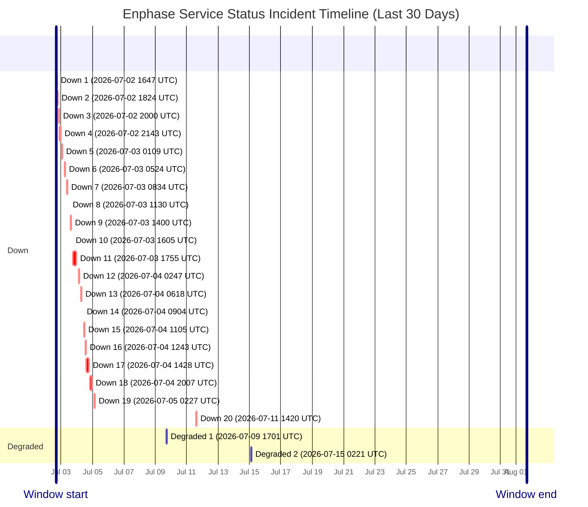

# Service Status History

- Current status: **Fully Operational**
- Last updated: `2026-08-01 15:35 UTC`
- Failed checks in latest run: `0`
- Latest failed checks: None
- Retained hourly samples: `372`
- Incident windows in last 30 days: `22`

This page is generated from hourly synthetic checks against Enphase cloud endpoints. It may miss incidents that begin and recover between checks.

## Incident Timeline

## Incident Summary

| Status | Started (UTC) | Ended (UTC) | Duration | Failed checks |
| --- | --- | --- | --- | --- |
| Down | 2026-07-02 16:47 UTC | Unknown after last seen 2026-07-02 16:47 UTC | Observed 0m | battery_config, evse_control, evse_scheduler, session_history |
| Down | 2026-07-02 18:24 UTC | Unknown after last seen 2026-07-02 18:24 UTC | Observed 0m | battery_config, evse_control, evse_scheduler, session_history |
| Down | 2026-07-02 20:00 UTC | Unknown after last seen 2026-07-02 20:00 UTC | Observed 0m | battery_config, evse_control, evse_scheduler, session_history |
| Down | 2026-07-02 21:43 UTC | Unknown after last seen 2026-07-02 23:04 UTC | Observed 1h 20m | battery_config, evse_control, evse_scheduler, session_history |
| Down | 2026-07-03 01:09 UTC | Unknown after last seen 2026-07-03 01:09 UTC | Observed 0m | battery_config, evse_control, evse_scheduler, session_history |
| Down | 2026-07-03 05:24 UTC | Unknown after last seen 2026-07-03 05:24 UTC | Observed 0m | battery_config, evse_control, evse_scheduler, session_history |
| Down | 2026-07-03 08:34 UTC | Unknown after last seen 2026-07-03 08:34 UTC | Observed 0m | battery_config, evse_control, evse_scheduler, session_history |
| Down | 2026-07-03 11:30 UTC | Unknown after last seen 2026-07-03 11:30 UTC | Observed 0m | battery_config, evse_control, evse_scheduler, session_history |
| Down | 2026-07-03 14:00 UTC | Unknown after last seen 2026-07-03 14:00 UTC | Observed 0m | battery_config, evse_control, evse_scheduler, session_history |
| Down | 2026-07-03 16:05 UTC | Unknown after last seen 2026-07-03 16:05 UTC | Observed 0m | battery_config, evse_control, evse_scheduler, session_history |
| Down | 2026-07-03 17:55 UTC | Unknown after last seen 2026-07-03 23:34 UTC | Observed 5h 38m | battery_config, evse_control, evse_scheduler, session_history |
| Down | 2026-07-04 02:47 UTC | Unknown after last seen 2026-07-04 02:47 UTC | Observed 0m | battery_config, evse_control, evse_scheduler, session_history |
| Down | 2026-07-04 06:18 UTC | Unknown after last seen 2026-07-04 06:18 UTC | Observed 0m | battery_config, evse_control, evse_scheduler, session_history |
| Down | 2026-07-04 09:04 UTC | Unknown after last seen 2026-07-04 09:04 UTC | Observed 0m | battery_config, evse_control, evse_scheduler, session_history |
| Down | 2026-07-04 11:05 UTC | Unknown after last seen 2026-07-04 11:05 UTC | Observed 0m | battery_config, evse_control, evse_scheduler, session_history |
| Down | 2026-07-04 12:43 UTC | Unknown after last seen 2026-07-04 12:43 UTC | Observed 0m | battery_config, evse_control, evse_scheduler, session_history |
| Down | 2026-07-04 14:28 UTC | Unknown after last seen 2026-07-04 18:31 UTC | Observed 4h 3m | battery_config, evse_control, evse_scheduler, session_history |
| Down | 2026-07-04 20:07 UTC | Unknown after last seen 2026-07-04 23:33 UTC | Observed 3h 26m | battery_config, evse_control, evse_scheduler, session_history |
| Down | 2026-07-05 02:27 UTC | 2026-07-05 04:16 UTC | 1h 49m | battery_config, evse_control, evse_scheduler, session_history |
| Degraded | 2026-07-09 17:01 UTC | Unknown after last seen 2026-07-09 17:01 UTC | Observed 0m | site_energy |
| Down | 2026-07-11 14:20 UTC | 2026-07-11 15:30 UTC | 1h 9m | auth |
| Degraded | 2026-07-15 02:21 UTC | Unknown after last seen 2026-07-15 02:21 UTC | Observed 0m | evse_scheduler |

## Raw Artifacts

- [Current status.json](https://raw.githubusercontent.com/barneyonline/ha-enphase-energy/service-status/status.json)
- [30-day history.json](https://raw.githubusercontent.com/barneyonline/ha-enphase-energy/service-status/history.json)
- [30-day incidents.json](https://raw.githubusercontent.com/barneyonline/ha-enphase-energy/service-status/incidents.json)

