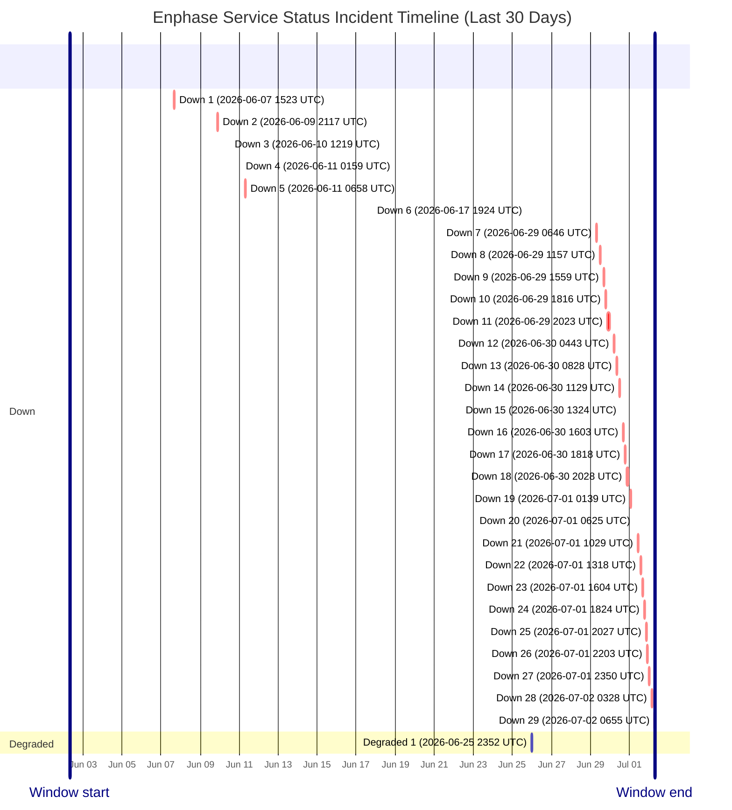

# Service Status History

- Current status: **Down**
- Last updated: `2026-07-02 06:55 UTC`
- Failed checks in latest run: `4`
- Latest failed checks: evse_scheduler, session_history, battery_config, evse_control
- Retained hourly samples: `258`
- Incident windows in last 30 days: `30`

This page is generated from hourly synthetic checks against Enphase cloud endpoints. It may miss incidents that begin and recover between checks.

## Incident Timeline

## Incident Summary

| Status | Started (UTC) | Ended (UTC) | Duration | Failed checks |
| --- | --- | --- | --- | --- |
| Down | 2026-06-07 15:23 UTC | 2026-06-07 16:50 UTC | 1h 27m | auth |
| Down | 2026-06-09 21:17 UTC | Unknown after last seen 2026-06-09 21:17 UTC | Observed 0m | battery_config, evse_runtime, evse_scheduler |
| Down | 2026-06-10 12:19 UTC | Unknown after last seen 2026-06-10 12:19 UTC | Observed 0m | battery_config, discovery, evse_scheduler |
| Down | 2026-06-11 01:59 UTC | Unknown after last seen 2026-06-11 01:59 UTC | Observed 0m | auth |
| Down | 2026-06-11 06:58 UTC | Unknown after last seen 2026-06-11 06:58 UTC | Observed 0m | auth |
| Down | 2026-06-17 19:24 UTC | Unknown after last seen 2026-06-17 19:24 UTC | Observed 0m | auth |
| Degraded | 2026-06-25 23:52 UTC | Unknown after last seen 2026-06-25 23:52 UTC | Observed 0m | battery_config, evse_scheduler |
| Down | 2026-06-29 06:46 UTC | Unknown after last seen 2026-06-29 06:46 UTC | Observed 0m | battery_config, evse_control, evse_scheduler, session_history |
| Down | 2026-06-29 11:57 UTC | Unknown after last seen 2026-06-29 11:57 UTC | Observed 0m | battery_config, evse_control, evse_scheduler, session_history |
| Down | 2026-06-29 15:59 UTC | Unknown after last seen 2026-06-29 15:59 UTC | Observed 0m | battery_config, evse_control, evse_scheduler, session_history |
| Down | 2026-06-29 18:16 UTC | Unknown after last seen 2026-06-29 18:16 UTC | Observed 0m | battery_config, evse_control, evse_scheduler, session_history |
| Down | 2026-06-29 20:23 UTC | Unknown after last seen 2026-06-30 00:03 UTC | Observed 3h 40m | battery_config, evse_control, evse_scheduler, session_history |
| Down | 2026-06-30 04:43 UTC | Unknown after last seen 2026-06-30 04:43 UTC | Observed 0m | battery_config, evse_control, evse_scheduler, session_history |
| Down | 2026-06-30 08:28 UTC | Unknown after last seen 2026-06-30 08:28 UTC | Observed 0m | battery_config, evse_control, evse_scheduler, session_history |
| Down | 2026-06-30 11:29 UTC | Unknown after last seen 2026-06-30 11:29 UTC | Observed 0m | battery_config, evse_control, evse_scheduler, session_history |
| Down | 2026-06-30 13:24 UTC | Unknown after last seen 2026-06-30 13:24 UTC | Observed 0m | battery_config, evse_control, evse_scheduler, session_history |
| Down | 2026-06-30 16:03 UTC | Unknown after last seen 2026-06-30 16:03 UTC | Observed 0m | battery_config, evse_control, evse_scheduler, session_history |
| Down | 2026-06-30 18:18 UTC | Unknown after last seen 2026-06-30 18:18 UTC | Observed 0m | battery_config, evse_control, evse_scheduler, session_history |
| Down | 2026-06-30 20:28 UTC | Unknown after last seen 2026-06-30 23:20 UTC | Observed 2h 51m | battery_config, evse_control, evse_scheduler, session_history |
| Down | 2026-07-01 01:39 UTC | Unknown after last seen 2026-07-01 01:39 UTC | Observed 0m | battery_config, evse_control, evse_scheduler, session_history |
| Down | 2026-07-01 06:25 UTC | Unknown after last seen 2026-07-01 06:25 UTC | Observed 0m | battery_config, evse_control, evse_scheduler, session_history |
| Down | 2026-07-01 10:29 UTC | Unknown after last seen 2026-07-01 10:29 UTC | Observed 0m | battery_config, evse_control, evse_scheduler, session_history |
| Down | 2026-07-01 13:18 UTC | Unknown after last seen 2026-07-01 13:18 UTC | Observed 0m | battery_config, evse_control, evse_scheduler, session_history |
| Down | 2026-07-01 16:04 UTC | Unknown after last seen 2026-07-01 16:04 UTC | Observed 0m | battery_config, evse_control, evse_scheduler, session_history |
| Down | 2026-07-01 18:24 UTC | Unknown after last seen 2026-07-01 18:24 UTC | Observed 0m | battery_config, evse_control, evse_scheduler, session_history |
| Down | 2026-07-01 20:27 UTC | Unknown after last seen 2026-07-01 20:27 UTC | Observed 0m | battery_config, evse_control, evse_scheduler, session_history |
| Down | 2026-07-01 22:03 UTC | Unknown after last seen 2026-07-01 22:03 UTC | Observed 0m | battery_config, evse_control, evse_scheduler, session_history |
| Down | 2026-07-01 23:50 UTC | Unknown after last seen 2026-07-01 23:50 UTC | Observed 0m | battery_config, evse_control, evse_scheduler, session_history |
| Down | 2026-07-02 03:28 UTC | Unknown after last seen 2026-07-02 03:28 UTC | Observed 0m | battery_config, evse_control, evse_scheduler, session_history |
| Down | 2026-07-02 06:55 UTC | Ongoing (last seen 2026-07-02 06:55 UTC) | Observed at latest check | battery_config, evse_control, evse_scheduler, session_history |

## Raw Artifacts

- [Current status.json](https://raw.githubusercontent.com/barneyonline/ha-enphase-energy/service-status/status.json)
- [30-day history.json](https://raw.githubusercontent.com/barneyonline/ha-enphase-energy/service-status/history.json)
- [30-day incidents.json](https://raw.githubusercontent.com/barneyonline/ha-enphase-energy/service-status/incidents.json)

