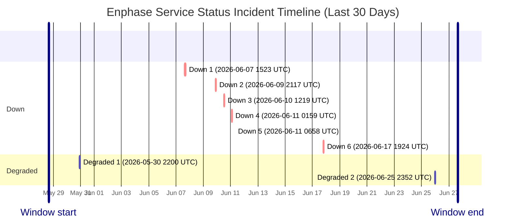

# Service Status History

- Current status: **Fully Operational**
- Last updated: `2026-06-27 15:14 UTC`
- Failed checks in latest run: `1`
- Latest failed checks: battery_config
- Retained hourly samples: `256`
- Incident windows in last 30 days: `8`

This page is generated from hourly synthetic checks against Enphase cloud endpoints. It may miss incidents that begin and recover between checks.

## Incident Timeline

## Incident Summary

| Status | Started (UTC) | Ended (UTC) | Duration | Failed checks |
| --- | --- | --- | --- | --- |
| Degraded | 2026-05-30 22:00 UTC | Unknown after last seen 2026-05-30 22:00 UTC | Observed 0m | battery_config, evse_scheduler |
| Down | 2026-06-07 15:23 UTC | 2026-06-07 16:50 UTC | 1h 27m | auth |
| Down | 2026-06-09 21:17 UTC | Unknown after last seen 2026-06-09 21:17 UTC | Observed 0m | battery_config, evse_runtime, evse_scheduler |
| Down | 2026-06-10 12:19 UTC | Unknown after last seen 2026-06-10 12:19 UTC | Observed 0m | battery_config, discovery, evse_scheduler |
| Down | 2026-06-11 01:59 UTC | Unknown after last seen 2026-06-11 01:59 UTC | Observed 0m | auth |
| Down | 2026-06-11 06:58 UTC | Unknown after last seen 2026-06-11 06:58 UTC | Observed 0m | auth |
| Down | 2026-06-17 19:24 UTC | Unknown after last seen 2026-06-17 19:24 UTC | Observed 0m | auth |
| Degraded | 2026-06-25 23:52 UTC | Unknown after last seen 2026-06-25 23:52 UTC | Observed 0m | battery_config, evse_scheduler |

## Raw Artifacts

- [Current status.json](https://raw.githubusercontent.com/barneyonline/ha-enphase-energy/service-status/status.json)
- [30-day history.json](https://raw.githubusercontent.com/barneyonline/ha-enphase-energy/service-status/history.json)
- [30-day incidents.json](https://raw.githubusercontent.com/barneyonline/ha-enphase-energy/service-status/incidents.json)

