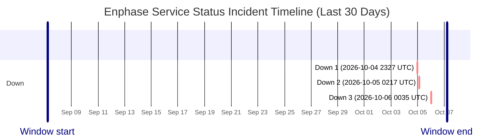

# Service Status History

- Current status: **Fully Operational**
- Last updated: `2026-10-07 04:25 UTC`
- Failed checks in latest run: `0`
- Latest failed checks: None
- Retained hourly samples: `171`
- Incident windows in last 30 days: `3`

This page is generated from hourly synthetic checks against Enphase cloud endpoints. It may miss incidents that begin and recover between checks.

## Incident Timeline

```mermaid
gantt
    title Enphase Service Status Incident Timeline (Last 30 Days)
    dateFormat  YYYY-MM-DDTHH:mm:ss
    axisFormat  %b %d
    Window start :vert, window-start, 2026-09-07T04:25:26, 0ms
    Window end :vert, window-end, 2026-10-07T04:25:26, 0ms
    section Down
    Down 1 (2026-10-04 2327 UTC) :crit, down-1, 2026-10-04T23:27:34, 60m
    Down 2 (2026-10-05 0217 UTC) :crit, down-2, 2026-10-05T02:17:30, 60m
    Down 3 (2026-10-06 0035 UTC) :crit, down-3, 2026-10-06T00:35:21, 60m
```

## Incident Summary

| Status | Started (UTC) | Ended (UTC) | Duration | Failed checks |
| --- | --- | --- | --- | --- |
| Down | 2026-10-04 23:27 UTC | Unknown after last seen 2026-10-04 23:27 UTC | Observed 0m | battery_config, evse_runtime, evse_scheduler |
| Down | 2026-10-05 02:17 UTC | Unknown after last seen 2026-10-05 02:17 UTC | Observed 0m | battery_config, evse_runtime, evse_scheduler |
| Down | 2026-10-06 00:35 UTC | Unknown after last seen 2026-10-06 00:35 UTC | Observed 0m | battery_config, evse_runtime, evse_scheduler |

## Raw Artifacts

- [Current status.json](https://raw.githubusercontent.com/barneyonline/ha-enphase-energy/service-status/status.json)
- [30-day history.json](https://raw.githubusercontent.com/barneyonline/ha-enphase-energy/service-status/history.json)
- [30-day incidents.json](https://raw.githubusercontent.com/barneyonline/ha-enphase-energy/service-status/incidents.json)

